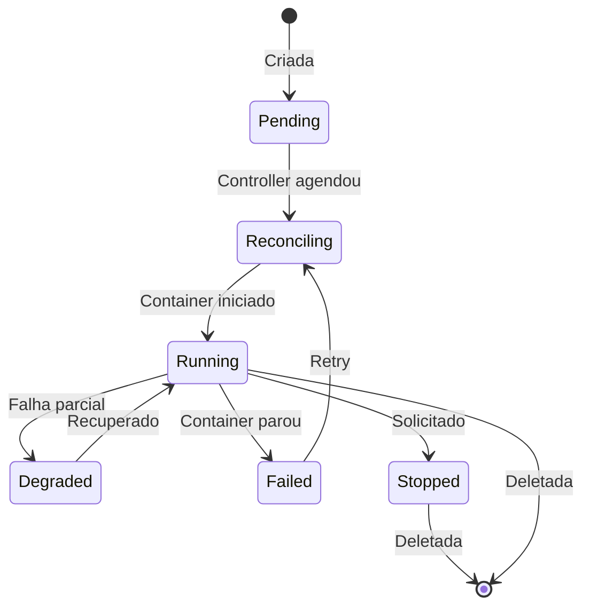

# Aplicações (Apps)

## O que é uma App?

Uma **App** representa uma aplicação containerizada que o Torukr gerencia. O Controller agenda a App em um node compatível e o NodeRuntime cria e monitora o container correspondente.

## Campos de uma App

| Campo | Tipo | Descrição |
|---|---|---|
| `name` | string | Nome da aplicação |
| `namespace` | string | Namespace de isolamento (padrão: `default`) |
| `phase` | string | Fase atual (veja fases abaixo) |
| `image` | string | Imagem Docker (ex: `nginx:latest`) |
| `replicas` | int | Número de réplicas desejadas (padrão: 1) |
| `assignedNodeID` | UUID | ID do node onde está rodando |
| `ingressHost` | string | Host para exposição via ingress (opcional) |
| `conditions` | array | Condições de saúde do recurso |
| `specJSON` | JSON | Especificação detalhada (portas, variáveis, etc.) |

## Fases de uma App



| Fase | Descrição |
|---|---|
| `Pending` | Criada, aguardando agendamento |
| `Reconciling` | Controller está processando |
| `Running` | Container rodando com sucesso |
| `Ready` | App pronta e saudável |
| `Healthy` | Saudável (confirmado por health check) |
| `Degraded` | Funcionando com degradação |
| `Warning` | Atenção necessária |
| `Failed` | Falhou, aguardando retry |
| `Error` | Erro não recuperável |
| `Stopped` | Parado manualmente |
| `Disabled` | Desabilitado |
| `Unknown` | Estado desconhecido |

## Manifest YAML

```yaml
apiVersion: platform.torukr.io/v1alpha1
kind: App
metadata:
  name: minha-api
  namespace: default
spec:
  image: minha-empresa/minha-api:v1.2.3
  replicas: 2
```

## Criar via CLI

```bash
# Via manifest
torukrctl apply -f minha-api.yaml

# Verificar status
torukrctl get apps
torukrctl describe app minha-api

# Remover
torukrctl delete app minha-api
```

## Criar via API

```bash
curl -X POST http://localhost:8080/api/v1/apps \
  -H "Authorization: Bearer $TOKEN" \
  -H "Content-Type: application/json" \
  -d '{
    "name": "minha-api",
    "namespace": "default",
    "image": "nginx:latest",
    "replicas": 1
  }'
```

## Namespaces

Apps são organizadas por namespace. O namespace padrão é `default`. Use a flag `-n` para especificar outro:

```bash
torukrctl get apps -n producao
torukrctl get apps --all-namespaces
```

## Condições

As condições fornecem informação detalhada sobre o estado da App:

```bash
torukrctl describe app minha-api
# Exibe seção:
# Conditions:
#   - Type: ContainersReady, Status: True, Reason: AllContainersRunning
#   - Type: NodeAssigned, Status: True, Reason: NodeSelected
```

## Próximos Passos

- [Tutorial: Fazer Deploy de App](/tutorials/deploy-app)
- [Referência da API: Apps](/reference/api#apps)
- [Referência da CLI](/reference/cli#get)
