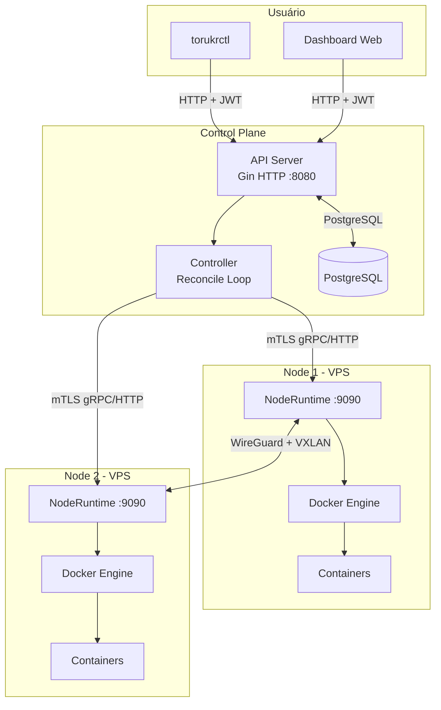
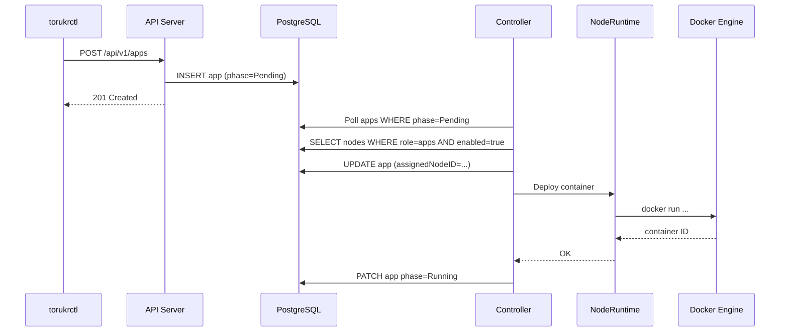
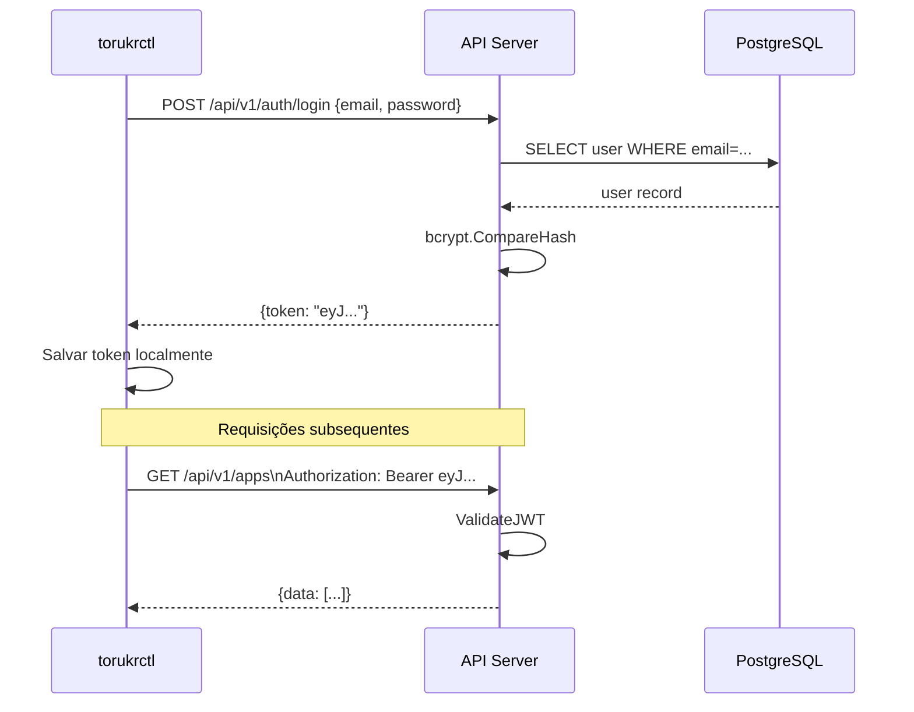
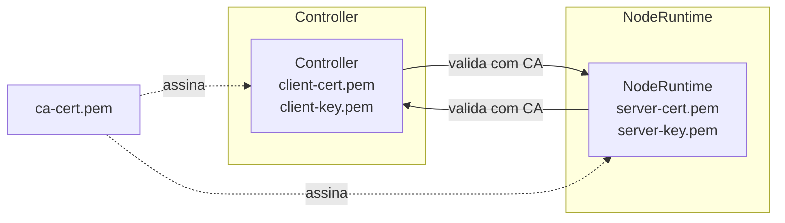

# Arquitetura

## Visão Geral

O Torukr segue uma arquitetura de **control plane + data plane** similar ao Kubernetes, mas simplificada para ambientes de VPS.



## Componentes

### API Server (`cmd/apiserver`)

- Framework: **Gin** (Go)
- Porta padrão: `8080`
- Autenticação: **JWT**
- Persistência: **PostgreSQL** via go-jet ORM
- Middlewares: CORS, rate limiting, logging, request ID, security headers, recovery

O API Server é o ponto central de entrada. Ele expõe uma API REST completa e armazena o estado de todos os recursos no banco de dados.

### Controller (`cmd/controller`)

- Processo de reconciliação contínua
- Monitora o banco via polling/eventos
- Reconciliadores: `AppReconciler`, `ResourceReconciler`, `NetworkReconciler`
- Se comunica com NodeRuntimes via **mTLS**

O Controller implementa o padrão de reconciliação: lê o estado desejado do banco e compara com o estado real reportado pelos NodeRuntimes, tomando ações corretivas.

### NodeRuntime (`cmd/noderuntime`)

- Agente que roda em cada VPS
- Porta padrão: `9090` (HTTPS com mTLS)
- Usa **Docker SDK** para gerenciar containers
- Reporta status de volta ao Controller

### torukrctl (`cmd/torukrctl`)

- CLI construída com **Cobra**
- Armazena configuração e token JWT localmente
- Suporta saída em tabela ou JSON

### gencerts (`cmd/gencerts`)

- Utilitário standalone para gerar CA, certificado de servidor e certificado de cliente
- Saída: arquivos PEM em diretório configurável

## Fluxo de Criação de uma App



## Fluxo de Autenticação



## Comunicação Controller ↔ NodeRuntime (mTLS)



Ambos os lados verificam o certificado do outro contra a mesma CA raiz. Isso é **mutual TLS (mTLS)**.

## Organização do Código

```
torukr/
├── cmd/                    # Binários (entrypoints)
│   ├── apiserver/         # API HTTP
│   ├── controller/        # Loop de reconciliação
│   ├── noderuntime/       # Agente do node
│   ├── gencerts/          # Gerador de certificados
│   └── torukrctl/         # CLI
├── internal/              # Código interno (não importável)
│   ├── apiserver/         # Handlers HTTP por domínio
│   ├── core/              # Domínio e casos de uso
│   │   ├── app/           # Lógica de aplicações
│   │   ├── resource/      # Lógica de recursos
│   │   └── node/          # Lógica de nodes
│   ├── controller/        # Reconciliadores
│   ├── noderuntime/       # Runtime handler
│   ├── infra/             # Infraestrutura
│   │   ├── database/      # Repositórios PostgreSQL
│   │   └── tls/           # Gerenciamento de TLS
│   └── cli/               # Lógica da CLI
├── pkg/                   # Pacotes públicos
│   ├── conditions/        # Condições de recursos
│   └── logger/            # Logger estruturado (zap)
└── graphify-out/          # Análise de grafo do código
```

## Próximos Passos

- [Conceito de Nodes](/concepts/nodes)
- [Conceito de Apps](/concepts/apps)
- [Network Overlay](/concepts/network-overlay)
- [Certificados e mTLS](/concepts/certificates)
