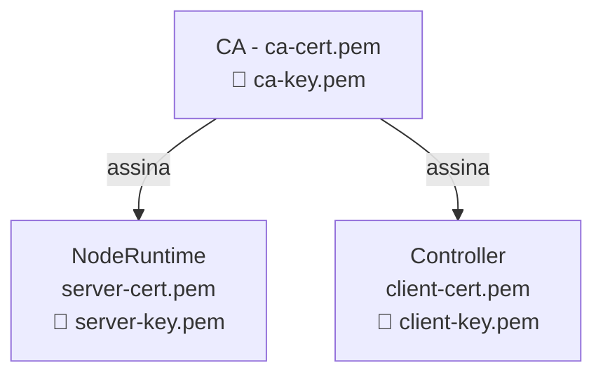

# Certificados e mTLS

## Por que Certificados?

O Torukr usa **mutual TLS (mTLS)** para autenticar e criptografar a comunicação entre o Controller e cada NodeRuntime. Sem mTLS, qualquer processo na rede poderia fingir ser um NodeRuntime e receber instruções do Controller.

## Hierarquia de Certificados



## Certificados Gerados pelo `gencerts`

O binário `cmd/gencerts` gera três pares de certificado/chave:

| Arquivo | Uso |
|---|---|
| `ca-cert.pem` | Certificado da CA raiz (distribuído para todos) |
| `ca-key.pem` | Chave privada da CA (**manter seguro, nunca distribuir**) |
| `server-cert.pem` | Certificado do NodeRuntime |
| `server-key.pem` | Chave privada do NodeRuntime |
| `client-cert.pem` | Certificado do Controller |
| `client-key.pem` | Chave privada do Controller |

### Detalhes do Certificado de Servidor

- **Common Name**: `noderuntime`
- **SANs**: `localhost`, `noderuntime`, `noderuntime.torukr.svc`
- Usado pelo: NodeRuntime (apresenta este cert ao Controller)

### Detalhes do Certificado de Cliente

- **Common Name**: `controller`
- **SANs**: `controller`, `controller.torukr.svc`
- Usado pelo: Controller (apresenta este cert ao NodeRuntime)

## Gerar Certificados

```bash
# Gerar no diretório ./certs (padrão)
go run cmd/gencerts/main.go

# Especificar diretório
go run cmd/gencerts/main.go -output /etc/torukr/certs
```

Saída esperada:

```
🔐 Generating TLS certificates for Torukr...
Output directory: ./certs

1. Generating CA certificate...
2. Generating NodeRuntime server certificate...
3. Generating Controller client certificate...

✅ Certificate generation complete!

Generated files:
  📄 CA Certificate:      ./certs/ca-cert.pem
  🔑 CA Key:              ./certs/ca-key.pem
  📄 Server Certificate:  ./certs/server-cert.pem
  🔑 Server Key:          ./certs/server-key.pem
  📄 Client Certificate:  ./certs/client-cert.pem
  🔑 Client Key:          ./certs/client-key.pem
```

## Configurar os Certificados

No arquivo `.env`:

```ini
TORUKR_TLS_ENABLED=true
TORUKR_TLS_CA_CERT=./certs/ca-cert.pem
TORUKR_TLS_SERVER_CERT=./certs/server-cert.pem
TORUKR_TLS_SERVER_KEY=./certs/server-key.pem
TORUKR_TLS_CLIENT_CERT=./certs/client-cert.pem
TORUKR_TLS_CLIENT_KEY=./certs/client-key.pem
```

### Configuração dos Componentes

| Componente | Certificados Necessários |
|---|---|
| **NodeRuntime** | `ca-cert.pem`, `server-cert.pem`, `server-key.pem` |
| **Controller** | `ca-cert.pem`, `client-cert.pem`, `client-key.pem` |
| **API Server** | Não usa mTLS (usa JWT para autenticação) |

## Verificar Certificados

```bash
# Ver conteúdo do certificado CA
openssl x509 -in certs/ca-cert.pem -text -noout

# Verificar que o servidor cert foi assinado pela CA
openssl verify -CAfile certs/ca-cert.pem certs/server-cert.pem

# Testar conexão mTLS com o NodeRuntime
curl --cacert ./certs/ca-cert.pem \
     --cert ./certs/client-cert.pem \
     --key ./certs/client-key.pem \
     https://localhost:9090/runtime/v1/healthz
```

## Modo Desenvolvimento (Inseguro)

Para desenvolvimento, você pode desabilitar a verificação de certificados:

```ini
TORUKR_TLS_INSECURE_SKIP_VERIFY=true
```

::: danger
Nunca use `INSECURE_SKIP_VERIFY=true` em produção. Isso elimina toda a proteção do mTLS.
:::

## Rotação de Certificados

Veja o [Tutorial de Rotação de Certificados](/tutorials/rotate-certificates) para o procedimento completo.

Resumo:

1. Gerar novos certificados com `gencerts`
2. Distribuir para os nodes
3. Reiniciar NodeRuntime e Controller
4. Verificar conectividade

## Boas Práticas

- Mantenha `ca-key.pem`, `server-key.pem` e `client-key.pem` com permissão `600`
- Adicione `*.pem` ao `.gitignore`
- Rotacione certificados a cada 12 meses em produção
- Em multi-node, copie apenas `ca-cert.pem`, `server-cert.pem`, `server-key.pem` para cada node worker

## Erros Comuns

| Erro | Causa | Solução |
|---|---|---|
| `certificate signed by unknown authority` | CA incorreta | Verificar `TORUKR_TLS_CA_CERT` |
| `tls: bad certificate` | Cert do cliente rejeitado | Verificar que o cert cliente foi assinado pela mesma CA |
| `connection refused` | NodeRuntime não está rodando | Verificar porta 9090 |
| `tls: no certificates configured` | Variáveis TLS não configuradas | Verificar o `.env` |

## Próximos Passos

- [Tutorial: Gerar Certificados](/setup/generate-certificates)
- [Tutorial: Rotacionar Certificados](/tutorials/rotate-certificates)
- [Segurança](/concepts/security)
