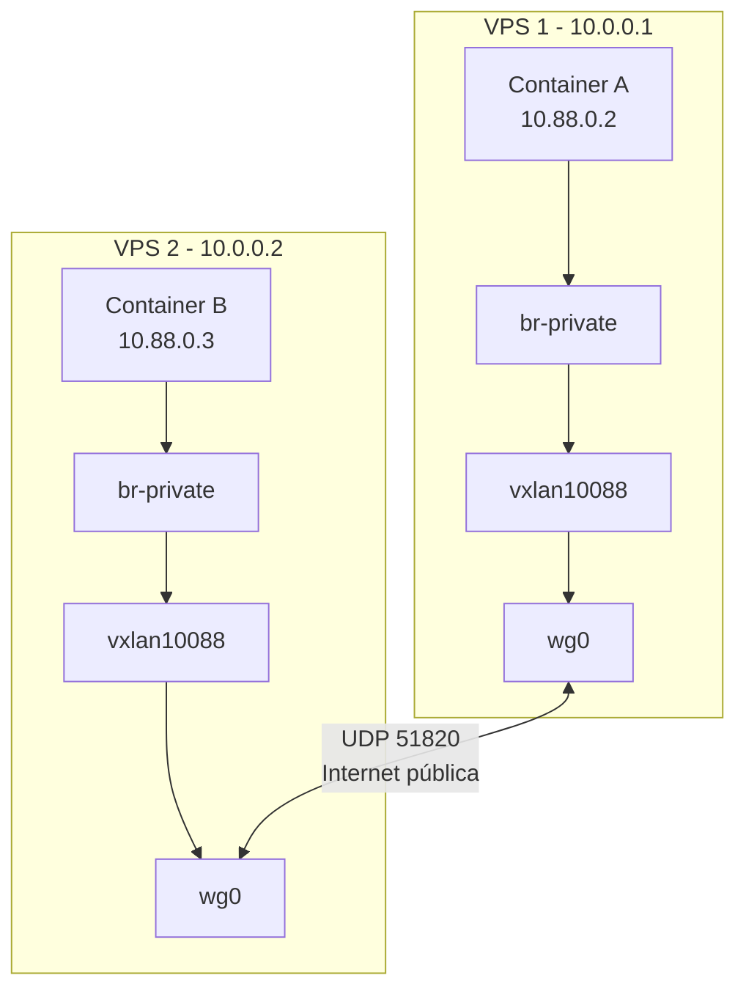

# Network Overlay

## O que é o Network Overlay?

O Network Overlay do Torukr permite que containers em VPS diferentes se comuniquem como se estivessem na mesma rede local, sem expor portas públicas. Ele é implementado com uma stack de três camadas:

1. **WireGuard** — túnel VPN criptografado entre nodes
2. **VXLAN** — extensão de L2 sobre o túnel WireGuard
3. **Linux bridge** — conecta containers à VXLAN

## Arquitetura



## Componentes da Stack

### WireGuard (`wg0`)

WireGuard é uma VPN moderna de alto desempenho. No Torukr:

- Cria um túnel ponto-a-ponto entre cada par de nodes
- Todo tráfego overlay passa por dentro do túnel WireGuard (criptografado)
- Porta UDP: `51820` (padrão WireGuard)

### VXLAN (`vxlan{VNI}`)

VXLAN (Virtual eXtensible LAN) encapsula frames Ethernet sobre UDP/IP:

- Permite estender redes L2 sobre infraestrutura L3 (internet)
- Cada network recebe um **VNI** (VXLAN Network Identifier) único
- O VNI é atribuído automaticamente pelo `NetworkReconciler`

### Linux Bridge (`br-private`)

A bridge conecta as interfaces de containers à VXLAN:

- Containers do Docker são conectados a esta bridge
- Recebem IPs no range da subnet configurada

### Docker Network

Uma Docker network é criada usando o bridge como backend, permitindo que containers se conectem a ela normalmente.

## Fluxo de Pacotes

```
Container A (10.88.0.2)
  → br-private (bridge local)
  → vxlan10088 (encapsulamento VXLAN)
  → wg0 (encriptação WireGuard)
  → Internet (UDP 51820) → VPS 2
  → wg0 (decriptação)
  → vxlan10088 (desencapsulamento)
  → br-private
  → Container B (10.88.0.3)
```

## Configurar Network Overlay

### Pré-requisitos

Em cada node worker:

```bash
# Instalar WireGuard
apt-get install wireguard-tools

# Verificar módulo do kernel
modprobe wireguard
lsmod | grep wireguard
```

### Criar Network via Manifest

```yaml
apiVersion: platform.torukr.io/v1alpha1
kind: Network
metadata:
  name: minha-rede
  namespace: default
spec:
  driver: overlay
  subnet: 10.88.0.0/16
  gateway: 10.88.0.1
  encrypted: true
```

```bash
torukrctl apply -f rede.yaml
```

O `NetworkReconciler` automaticamente:

1. Aloca um VNI único
2. Distribui configuração WireGuard para cada NodeRuntime
3. Instrui os NodeRuntimes a criar as interfaces de rede

## Verificar Conectividade

```bash
# No VPS 1
ping 10.88.0.3  # IP do container no VPS 2

# Verificar interface WireGuard
wg show wg0

# Verificar VXLAN
ip link show vxlan10088

# Verificar bridge
bridge link show
```

## Portas Necessárias

| Porta | Protocolo | Uso |
|---|---|---|
| `51820` | UDP | WireGuard |
| `9090` | TCP | Controller → NodeRuntime (mTLS) |

## Limitações Atuais

- O NetworkReconciler gerencia o estado de redes mas a implementação completa de provisionamento automático de WireGuard entre nodes pode requerer configuração manual em algumas versões.
- Verifique os logs do Controller para confirmar o status do reconciliador de redes.

## Troubleshooting

### WireGuard sem handshake

```bash
# Ver status do peer WireGuard
wg show wg0

# Verificar se a porta UDP está aberta no firewall
ufw status
iptables -L -n | grep 51820
```

### VXLAN sem tráfego

```bash
# Ver tabela de encaminhamento do bridge
bridge fdb show dev vxlan10088

# Capturar tráfego na interface VXLAN
tcpdump -i vxlan10088 -n
```

### Container não consegue pingar outro container

```bash
# Verificar rota no container
docker exec container-a ip route

# Verificar regras iptables
iptables -L FORWARD -n
```

## Próximos Passos

- [Tutorial: Conectar Dois Nodes](/tutorials/connect-two-nodes)
- [Instalar Overlay Network](/setup/install-overlay-network)
- [Troubleshooting de Redes](/operations/troubleshooting#network-overlay)
