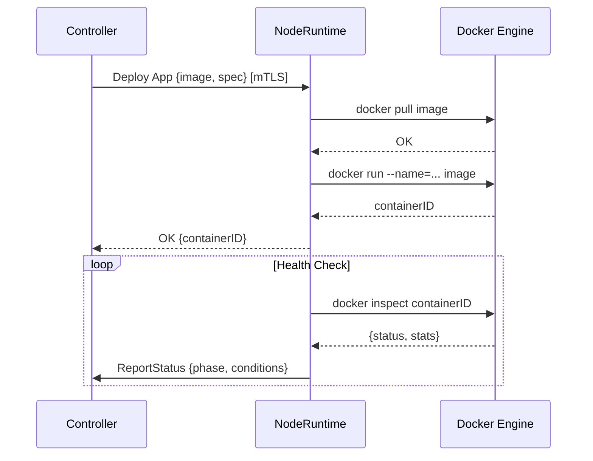

# Node Runtime

## O que é o NodeRuntime?

O **NodeRuntime** é o agente do Torukr que roda em cada VPS. Ele recebe instruções do Controller e as executa localmente usando o Docker SDK.

## Responsabilidades

- Receber instruções do Controller via mTLS
- Criar, iniciar e parar containers Docker
- Configurar interfaces de rede (VXLAN, bridges) para o overlay
- Reportar status dos workloads de volta ao Controller
- Coletar e disponibilizar logs dos containers

## Comunicação



## Porta e TLS

- Porta padrão: `9090` (HTTPS)
- Requer `server-cert.pem` e `server-key.pem` (assinados pela CA do Torukr)
- Verifica o certificado do Controller contra `ca-cert.pem`

## Configuração

Variáveis de ambiente necessárias no node:

```ini
RUNTIME_PORT=9090

# TLS
TORUKR_TLS_ENABLED=true
TORUKR_TLS_CA_CERT=/etc/torukr/certs/ca-cert.pem
TORUKR_TLS_SERVER_CERT=/etc/torukr/certs/server-cert.pem
TORUKR_TLS_SERVER_KEY=/etc/torukr/certs/server-key.pem
```

## Iniciar o NodeRuntime

```bash
# Direto
./bin/noderuntime

# Como serviço systemd
cat > /etc/systemd/system/torukr-noderuntime.service << 'EOF'
[Unit]
Description=Torukr NodeRuntime
After=network.target docker.service
Requires=docker.service

[Service]
Type=simple
WorkingDirectory=/opt/torukr
EnvironmentFile=/opt/torukr/.env
ExecStart=/opt/torukr/bin/noderuntime
Restart=always
RestartSec=5
User=torukr

[Install]
WantedBy=multi-user.target
EOF

systemctl daemon-reload
systemctl enable --now torukr-noderuntime
```

## Verificar Health

```bash
# Com mTLS
curl --cacert ./certs/ca-cert.pem \
     --cert ./certs/client-cert.pem \
     --key ./certs/client-key.pem \
     https://localhost:9090/runtime/v1/healthz

# Ver logs do serviço
journalctl -u torukr-noderuntime -f
```

## Logs de Containers

O NodeRuntime disponibiliza logs via API:

```bash
# Logs de um app (via API Server)
curl -H "Authorization: Bearer $TOKEN" \
  "http://localhost:8080/api/v1/namespaces/default/apps/minha-api/logs"

# Streaming de logs
curl -H "Authorization: Bearer $TOKEN" \
  "http://localhost:8080/api/v1/namespaces/default/apps/minha-api/logs/stream"

# Logs de um node
curl -H "Authorization: Bearer $TOKEN" \
  "http://localhost:8080/api/v1/nodes/{nodeID}/logs"
```

::: info
O streaming de logs (`/logs/stream`) está implementado na API mas o suporte completo a streaming em tempo real pode variar. Consulte os logs do NodeRuntime para detalhes.
:::

## Próximos Passos

- [Instalar NodeRuntime em Worker](/setup/install-worker-node)
- [Certificados](/concepts/certificates)
- [Logs](/operations/logs)
