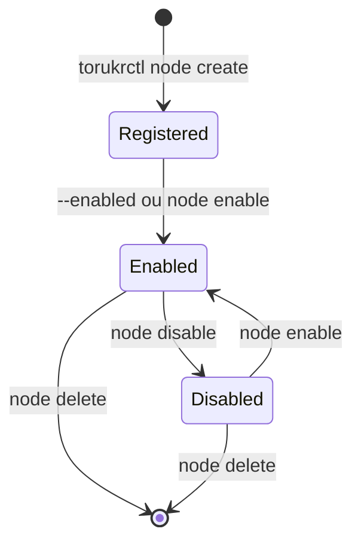

# Nodes

## O que é um Node?

Um **Node** no Torukr representa um servidor VPS onde workloads serão executados. O NodeRuntime deve estar rodando nesse servidor para que o Controller possa provisionar containers nele.

## Campos de um Node

| Campo | Tipo | Descrição |
|---|---|---|
| `name` | string | Nome único do node |
| `role` | string | `apps` ou `resources` |
| `privateIP` | string | IP privado do servidor |
| `enabled` | bool | Se o node aceita novos workloads |
| `hostname` | string | Hostname do servidor (opcional) |
| `agentURL` | string | URL do NodeRuntime (preenchido automaticamente) |
| `labels` | map | Chave/valor para seleção de node |
| `capacityCPU` | string | CPU total disponível |
| `capacityMemory` | string | Memória total disponível |
| `capacityDisk` | string | Disco total disponível |
| `allocatableCPU` | string | CPU disponível para workloads |
| `allocatableMemory` | string | Memória disponível para workloads |
| `allocatableDisk` | string | Disco disponível para workloads |

## Roles de Nodes

O role define quais tipos de workload o node pode receber:

- **`apps`**: Recebe workloads do tipo `App` (aplicações containerizadas)
- **`resources`**: Recebe workloads do tipo `Resource` (bancos de dados, serviços de suporte)

O Controller respeita o role ao agendar novos workloads.

## Labels

Labels são pares chave/valor usados para agrupar e selecionar nodes. Exemplos comuns:

```bash
# Node para produção na região Brasil
torukrctl node create \
  --name vps-br-prod-1 \
  --address 10.0.0.10 \
  --role apps \
  --labels region=br,env=prod,datacenter=sp

# Node para staging
torukrctl node create \
  --name vps-staging \
  --address 10.0.0.20 \
  --role apps \
  --labels env=staging
```

## Ciclo de Vida de um Node



### Estados

| Estado | Descrição |
|---|---|
| **Enabled = true** | Node aceita novos workloads agendados pelo Controller |
| **Enabled = false** | Node não recebe novos workloads (workloads existentes permanecem) |

## Gerenciar Nodes com torukrctl

### Criar node

```bash
torukrctl node create \
  --name meu-vps \
  --address 192.168.1.10 \
  --role apps \
  --enabled
```

### Listar nodes

```bash
torukrctl get nodes
```

### Ver detalhes

```bash
torukrctl describe node meu-vps
```

### Habilitar / desabilitar

```bash
torukrctl node enable meu-vps
torukrctl node disable meu-vps
```

### Adicionar labels

```bash
torukrctl node label meu-vps region=br env=prod
```

### Remover labels

```bash
torukrctl node unlabel meu-vps region env
```

### Deletar node

```bash
torukrctl delete node meu-vps
```

## Status de Nodes

O Controller reporta o status dos nodes periodicamente. Use a API para obter o último status:

```bash
curl -H "Authorization: Bearer $TOKEN" \
  http://localhost:8080/api/v1/nodes/{id}/status/latest
```

## Próximos Passos

- [Tutorial: Criar o Primeiro Node](/tutorials/create-first-node)
- [Referência da CLI: node commands](/reference/cli#node)
- [Conceito de Apps](/concepts/apps)
