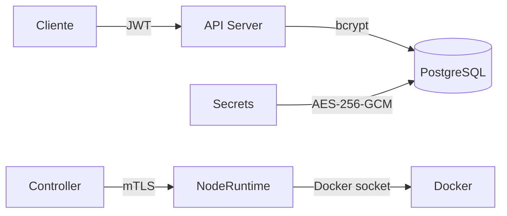

# Segurança

## Modelo de Segurança

O Torukr implementa múltiplas camadas de segurança:



## Autenticação de Usuários (JWT)

- Senhas armazenadas com **bcrypt**
- Autenticação via JWT (HS256)
- Tokens expiram conforme `JWT_EXPIRY_HOURS`
- O `JWT_SECRET` é validado: deve ter entropia suficiente

## mTLS Controller ↔ NodeRuntime

Toda comunicação entre Controller e NodeRuntime usa **mutual TLS**:

- Ambos os lados apresentam certificados
- Ambos os lados verificam o certificado do outro contra a CA raiz
- Impede que processos não autorizados recebam instruções do Controller

Veja [Certificados](/concepts/certificates) para detalhes.

## Criptografia de Secrets (AES-256-GCM)

Secrets (senhas geradas automaticamente para Resources) são criptografados em repouso no banco de dados usando AES-256-GCM com a `TORUKR_MASTER_KEY`.

```ini
# Gerar master key segura
TORUKR_MASTER_KEY=$(openssl rand -base64 32)
```

A master key nunca é armazenada no banco — apenas usada em memória para criptografar/decriptografar.

## RBAC (Controle de Acesso por Role)

O Torukr tem uma estrutura de RBAC com:

- **Usuários** — contas de acesso
- **Roles** — agrupam permissões
- **Permissions** — operações permitidas
- **RoleBindings** — associam roles a usuários

```bash
# Via API
# Criar role
POST /api/v1/roles

# Criar permissão
POST /api/v1/permissions

# Vincular permissão ao role
POST /api/v1/roles/{id}/permissions

# Vincular role ao usuário
POST /api/v1/users/{id}/roles
```

::: info Limitação Atual
O sistema de RBAC está implementado na camada de dados (repositórios e API), mas a verificação de permissões não está aplicada em todos os endpoints. Esta é uma limitação conhecida — veja [Limitações Conhecidas](/operations/known-limitations).
:::

## Security Headers

O middleware de segurança adiciona automaticamente:

- `X-Content-Type-Options: nosniff`
- `X-Frame-Options: DENY`
- `X-XSS-Protection: 1; mode=block`
- `Referrer-Policy: strict-origin-when-cross-origin`

## Rate Limiting

Rate limiting por IP é aplicado em todas as rotas da API usando token bucket (`golang.org/x/time/rate`).

## Validação do Banco de Dados em Produção

Quando `ENV=production`, o Torukr valida que o `DATABASE_DSN` usa conexão TLS com o PostgreSQL. Conexões sem TLS em produção são rejeitadas na inicialização.

## Boas Práticas de Segurança

### Em Produção

- `TORUKR_TLS_ENABLED=true` (obrigatório)
- `JWT_SECRET` com no mínimo 32 caracteres e alta entropia
- `TORUKR_MASTER_KEY` gerado com `openssl rand -base64 32`
- Chaves privadas (`*-key.pem`) com permissão `600`
- `DATABASE_DSN` com `sslmode=require` ou `sslmode=verify-full`
- `ENV=production` para ativar validações extras

### Nunca Faça

- `TORUKR_TLS_INSECURE_SKIP_VERIFY=true` em produção
- Commitar `*.pem` ou `.env` no git
- Usar a master key de desenvolvimento em produção
- Deixar a porta 9090 (NodeRuntime) exposta na internet sem firewall

## Próximos Passos

- [Certificados e mTLS](/concepts/certificates)
- [Variáveis de Ambiente](/setup/environment-variables)
- [Checklist de Produção](/operations/production-readiness)
