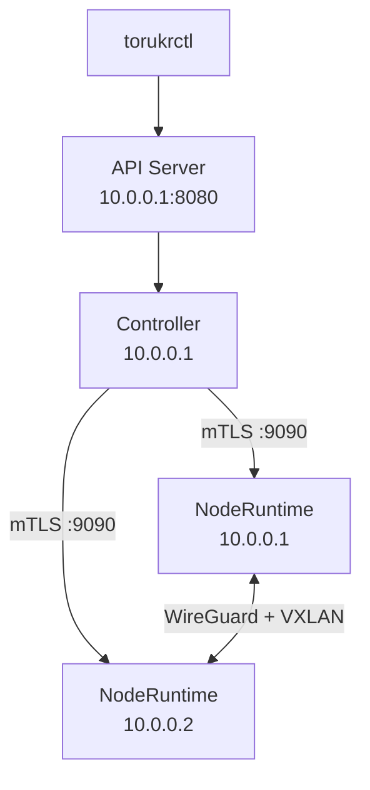

# Configuração Multi-Node

Este guia cobre como adicionar nodes adicionais ao seu cluster Torukr e configurar o network overlay entre eles.

## Arquitetura Multi-Node



## Pré-requisitos

- Node principal configurado (veja [Node Único](/getting-started/single-node))
- Segundo VPS com Docker e WireGuard instalados
- Conectividade de rede entre os VPS (portas 9090/TCP e 51820/UDP abertas)

## Passo 1: Instalar NodeRuntime no Segundo VPS

No segundo VPS:

```bash
# Copiar o binário (ou compilar localmente)
scp torukr/bin/noderuntime usuario@10.0.0.2:/usr/local/bin/noderuntime

# Copiar os certificados do servidor
scp torukr/certs/ca-cert.pem usuario@10.0.0.2:/etc/torukr/certs/
scp torukr/certs/server-cert.pem usuario@10.0.0.2:/etc/torukr/certs/
scp torukr/certs/server-key.pem usuario@10.0.0.2:/etc/torukr/certs/
```

## Passo 2: Configurar o NodeRuntime no Segundo VPS

No segundo VPS, crie o arquivo `.env`:

```ini
ENV=production
RUNTIME_PORT=9090

TORUKR_TLS_ENABLED=true
TORUKR_TLS_CA_CERT=/etc/torukr/certs/ca-cert.pem
TORUKR_TLS_SERVER_CERT=/etc/torukr/certs/server-cert.pem
TORUKR_TLS_SERVER_KEY=/etc/torukr/certs/server-key.pem
```

Iniciar o NodeRuntime:

```bash
noderuntime
```

## Passo 3: Registrar o Novo Node

Na sua máquina local (com torukrctl configurado):

```bash
torukrctl node create \
  --name vps-2 \
  --address 10.0.0.2 \
  --role apps \
  --labels region=br,datacenter=sp \
  --enabled
```

Verificar:

```bash
torukrctl get nodes
```

```
NAME          ROLE   ENABLED  PRIVATE IP  LABELS                      CREATED
vps-principal apps   true     10.0.0.1    region=br,datacenter=rj     ...
vps-2         apps   true     10.0.0.2    region=br,datacenter=sp     ...
```

## Passo 4: Configurar Network Overlay

O overlay usa WireGuard para comunicação criptografada entre nodes. Veja [Instalar Overlay Network](/setup/install-overlay-network) para detalhes completos.

```bash
cat > network-privada.yaml << 'EOF'
apiVersion: platform.torukr.io/v1alpha1
kind: Network
metadata:
  name: cluster-privado
  namespace: default
spec:
  driver: overlay
  subnet: 10.88.0.0/16
  gateway: 10.88.0.1
  encrypted: true
EOF

torukrctl apply -f network-privada.yaml
```

## Passo 5: Verificar Conectividade

```bash
# Deploy de app em cada node e testar comunicação
torukrctl get networks
torukrctl describe network cluster-privado
```

## Roles de Nodes

Ao criar nodes, você define o `role`:

| Role | Descrição |
|---|---|
| `apps` | Recebe workloads de App |
| `resources` | Recebe workloads de Resource (bancos, serviços) |

O Controller usa o role para agendar workloads nos nodes corretos.

## Próximos Passos

- [Conectar dois nodes com tutorial passo a passo](/tutorials/connect-two-nodes)
- [Network Overlay em detalhe](/concepts/network-overlay)
- [Produção: checklist](/operations/production-readiness)
