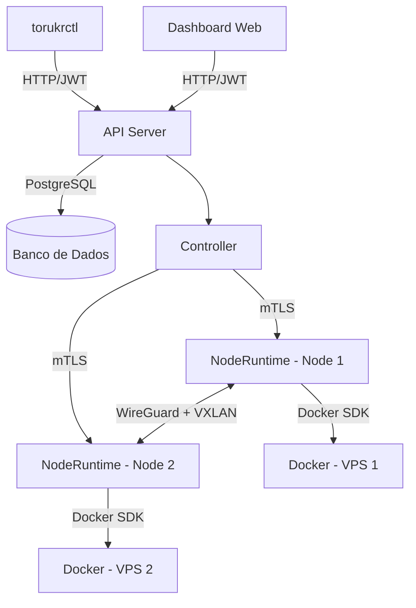

# Visão Geral

## O que é o Torukr?

O **Torukr** é uma plataforma declarativa para orquestrar aplicações, servidores VPS, redes privadas e recursos de infraestrutura de forma simples, segura e previsível.

Ele foi criado para quem precisa operar aplicações distribuídas em múltiplos servidores, mas não quer assumir toda a complexidade operacional de um cluster Kubernetes completo.

Com o Torukr, você descreve o estado desejado da sua infraestrutura em manifests YAML — nodes, apps, networks e resources — e a plataforma se encarrega de aplicar, reconciliar e manter esse estado nos servidores.

Em vez de acessar cada VPS manualmente via SSH, configurar Docker, redes, certificados e comunicação entre serviços de forma separada, o Torukr centraliza o controle e automatiza a operação.

O Torukr não tenta substituir Kubernetes em cenários de grande escala. Ele oferece uma alternativa mais simples para quem quer organização, manifests declarativos e controle multi-node sem carregar toda a complexidade de um cluster Kubernetes completo.

## Para que serve o Torukr?

O Torukr transforma um conjunto de servidores VPS em uma plataforma organizada para deploy e operação de aplicações.

Com ele, você pode:

- Registrar servidores como **nodes**
- Criar **networks** privadas entre nodes
- Fazer deploy de **apps** containerizadas
- Declarar serviços auxiliares como **resources**
- Usar manifests YAML para versionar infraestrutura no Git
- Aplicar mudanças com `torukrctl apply`
- Reduzir a necessidade de SSH manual em cada servidor
- Operar ambientes multi-node com uma camada declarativa mais simples que Kubernetes

## Por que não apenas Docker puro?

Docker é excelente para rodar containers, mas não resolve sozinho a operação de múltiplos servidores.

Quando a aplicação começa a crescer, surgem perguntas como:

- Em qual servidor cada aplicação deve rodar?
- Como conectar serviços em VPS diferentes?
- Como padronizar deploys?
- Como evitar configuração manual via SSH?
- Como versionar infraestrutura?
- Como repetir o mesmo ambiente em outro servidor?
- Como configurar comunicação segura entre nodes?
- Como saber o estado desejado versus o estado real?

O Torukr usa Docker nos nodes, mas adiciona uma camada de orquestração, controle, rede e configuração declarativa.

## Por que não Kubernetes?

Kubernetes é poderoso, mas muitas vezes é maior do que o problema.

Para homelabs, SaaS pequenos, aplicações internas, ambientes VPS e times pequenos, Kubernetes pode trazer:

- Curva de aprendizado alta
- Muitos componentes obrigatórios
- Operação complexa
- Custo maior de infraestrutura
- Excesso de abstrações para cenários simples

O Torukr busca uma abordagem mais direta:

- Menos componentes
- Mais fácil de instalar
- Mais próximo do ambiente VPS tradicional
- Manifests declarativos
- CLI familiar
- Rede privada entre nodes
- Controle centralizado
- Operação mais simples para projetos menores

## Ideia central

> Descreva o que você quer rodar. O Torukr decide como aplicar isso nos seus servidores.

Exemplo:

```yaml
apiVersion: platform.torukr.io/v1alpha1
kind: App
metadata:
  name: api
spec:
  image: ghcr.io/example/api:1.0.0
  ports:
    - containerPort: 8080
  networks:
    - name: private
```

Depois:

```bash
torukrctl apply -f app.yaml
```

O Torukr lê o manifesto, registra o estado desejado e reconcilia a aplicação nos nodes disponíveis.

## Arquitetura em Alto Nível



## Componentes

### API Server

Exposição HTTP/HTTPS com autenticação JWT. Recebe comandos do `torukrctl` e do dashboard web. Armazena o estado em PostgreSQL.

### Controller

Processo que monitora constantemente o estado dos recursos e reconcilia diferenças. Quando você cria um App, o Controller determina qual node deve rodá-lo e instrui o NodeRuntime correspondente.

### NodeRuntime

Agente que roda em cada VPS. Recebe instruções do Controller via mTLS e as executa usando o Docker SDK.

### torukrctl

CLI com comandos familiares (`get`, `describe`, `apply`, `delete`) para interagir com a API do Torukr.

## Próximos Passos

- [Instalar o Torukr](/getting-started/installation)
- [Início Rápido](/getting-started/quickstart)
- [Arquitetura detalhada](/concepts/architecture)
